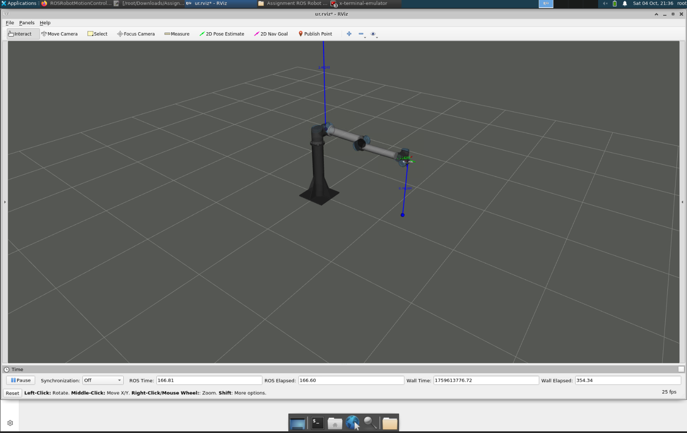
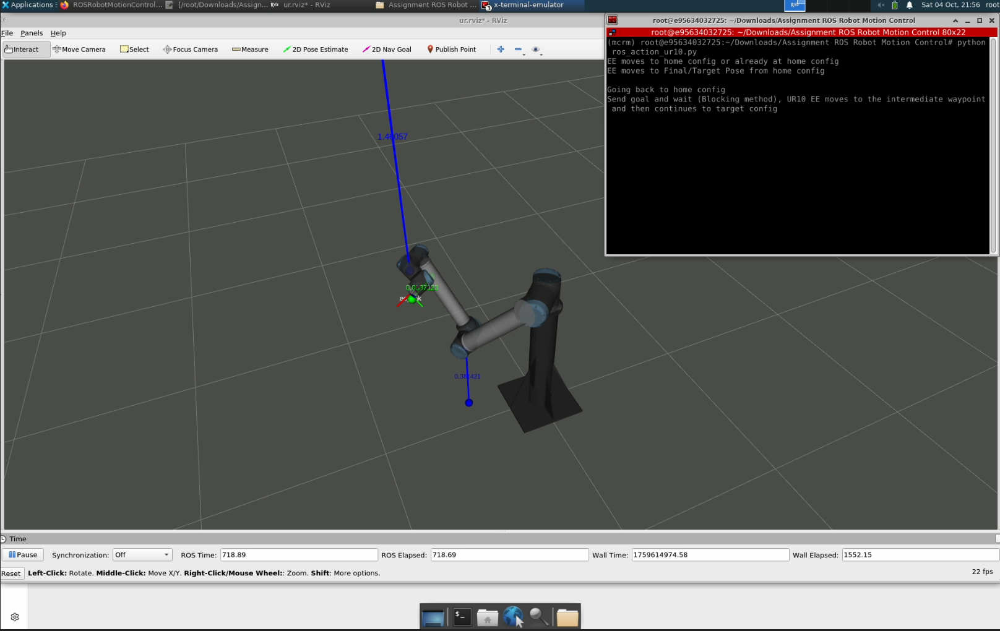

## ROS (noetic) Action Experiment with UR10

This project provides a ready-to-use ROS Noetic environment using Docker, with UR10 robot simulation in Gazebo and integration with Python-based control scripts.
You’ll be able to:
* Run UR10 simulation in Gazebo
* Use noVNC and web terminal inside the container
* Experiment with action methods like blocking and non-blocking where goals are sent and tracked/not tracked to achieve certain tasks with more organized approach which is more realistic during implementation phase of various applications.
* Control the UR10 end-effector through waypoints via Python script.

## Prerequisites

* Docker installed on your system. [Support link](https://docs.docker.com/engine/install/ubuntu/)

## Setup Instructions
The following docker has been reused from the [linked]([https://docs.docker.com/engine/install/ubuntu/](https://github.com/vinayakaraju46/ROS-for-Apple-Silicon/tree/ros-noetic)) source and more info. can be found there.

1. Clone the Repository
```bash
git clone https://github.com/vinayakaraju46/ROS-for-Apple-Silicon.git -b ros-noetic
cd ROS-for-Apple-Silicon/ros-simulation
```
2. Build & Run Docker Container
```bash
docker-compose build --no-cache
docker-compose up
```
Once running, access via:
* noVNC (GUI Desktop): http://localhost:4001
* Web Terminal: http://localhost:4000

## ROS Setup Inside Container

3. Install Dependencies
```bash
sudo apt update
sudo apt install ros-noetic-navigation ros-noetic-teb-local-planner ros-noetic-mpc-local-planner \
  ros-noetic-joint-state-publisher-gui ros-noetic-costmap-converter ros-noetic-libg2o \
  ros-noetic-ros-control ros-noetic-ros-controllers ros-noetic-kobuki-msgs \
  ros-noetic-fkie-master-discovery python3-rosinstall python3-rosinstall-generator \
  python3-wstool python3-rosdep build-essential
```

4. Create Workspace
```bash
mkdir -p ~/ros_ws/src
cd ~/ros_ws
```
Unzip and place the universal_robot package inside src.

5. Install Custom Robot Utilities
```bash
sudo apt install ./ros-noetic-robot-utilities_0.6.3-0focal_amd64.deb
```
6. Resolve Missing Dependencies
```bash
rosdep install --from-paths ./ --ignore-src --rosdistro noetic -y
(If -y doesn’t work, confirm manually with YES)
```
7. Build Workspace
```bash
catkin_make
```
8. Source Workspace
```bash
#Add to .bashrc for persistence:
echo "source ~/ros_ws/devel/setup.bash" >> ~/.bashrc
source ~/.bashrc
```

## Running UR10 Simulation
Launch the UR10 simulation in Gazebo:
```bash
roslaunch ur_launch ur10_sim_gazebo.launch rqt:=false
```
If you see xacro errors, fix with:
```bash
sudo apt update
sudo apt install ros-noetic-ur-description ros-noetic-ur-gazebo \
  ros-noetic-ur-robot-driver ros-noetic-xacro ros-noetic-ur*
```

Close RViz with Ctrl+C in its terminal if it was working fine.

## Python Virtual Environment Setup
```bash
# 9. Install Tools
sudo apt install python-is-python3 python3.8-venv pip
# 10. Create & Activate Virtual Environment
python -m venv ur10_env
source ur10_env/bin/activate
# 11. Install Python Dependencies
pip install ipykernel ipympl pybullet rospkg
# 12. Install Robotics Toolbox (find in the repo)
cd ~/Downloads/robotics-toolbox-python-master
pip install ansitable==0.11.1
# 13. Install Jupyter Notebook (it worked for me, suitable version have to be found)
pip install jupyterlab==4.3.8 notebook==6.5.6
```

## Run UR10 Control Script
```bash
#Navigate to project location:
cd ~/Downloads/ros_noetic_action_ur10/
chmod +x *
python ros_noetic_action_ur10.py
```
The UR10 end-effector (EE) will move to the target configuration through intermediate waypoints using:
* Blocking mode: send goal & wait
* Non-blocking mode: send goal (fire and forget method)
  



### Future Work
* Using the same platform to experiment different basic ROS concepts
* To develop easy to use platform for beginner, next build will use ROS2 humble.

### License and Acknowledgement
This project is open-source under the MIT License. Most of the supporting files and required custom packages were prepared by Chair of Control Theory and Systems Engineering at TU Dortmund, Germany. This work was a part of laboratory work of lecture named "Modelling and Control of Robotic Manipulator." Further the docker used in this project was modified version of the [linked](https://github.com/vinayakaraju46/ROS-for-Apple-Silicon/tree/ros-noetic) source and credits to the contributor.
